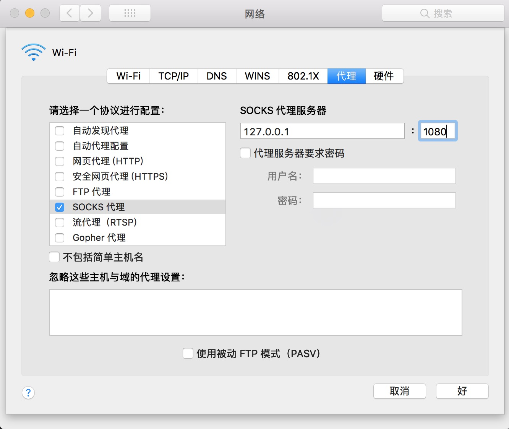

# go socks5 server

基于 go 与 socks5 协议的，**简单**穿墙服务实践

[wikipedia socks5 协议内容](https://zh.wikipedia.org/wiki/SOCKS)

### 功能点

- [x] 域名代理
- [x] ipv4代理
- [ ] ipv6代理
- [x] handshake 阶段
- [ ] auth 验证
- [x] request 阶段
- [x] 双关通信
- [ ] 双关通信，包引入加密算法


### 启动

```sh
> go build main.go

> ./main
```

### node.js 版本

[node.js github.com](https://github.com/Kyoloro/node-socks5)

### macOS `socks5` 代理

